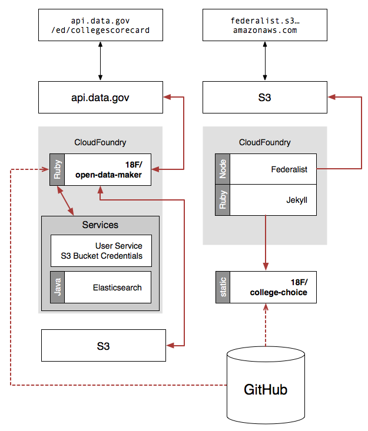

# College Scorecard

A website that allows students (high school and adult) and those who support them (parents, guidance counselors)
to not only search among colleges to find schools that would meet their desires, but also encourage them to consider
"value" factors, be exposed to schools with better outcomes, and allow users to compare and contrast schools across
different dimensions of "fit," highlighting "value" factors. The goal is to enable people to find schools that are
best suited to them, and ensure a broad and flexible definition of elements that contribute to "fit."

This repo contains the front end of a web app with its API created by an instance of [Open Data Maker](https://github.com/RTICWDT/open-data-maker) which is configured with a specific data set. For more details on setting up the back end of the web app, see below: [Running the API Locally](#running-the-api-locally).  However, you can run the web app with the hosted API following the installation instructions in the next section.

#### Build Status
* [production](https://github.com/RTICWDT/college-scorecard/tree/master/) [](https://circleci.com/gh/RTICWDT/college-scorecard)
* [staging](https://github.com/RTICWDT/college-scorecard/tree/staging/) [](https://circleci.com/gh/RTICWDT/college-scorecard/tree/staging)
* [development](https://github.com/RTICWDT/college-scorecard/tree/dev/) [](https://circleci.com/gh/RTICWDT/college-scorecard/tree/dev)


## Installation
Create a local development environment using Docker containers or with a traditional
unix system.

### Docker Container
- Copy `.env.example` to `.env`
- Add values to `.env`
- In App Root: Start Docker Containers 
  - `docker-compose up`
  - You can start it with `docker-compose up -d` to detach the process from the current shell if desired. 
- Wait for output:
```
web_1   |     Server address: http://0.0.0.0:4000/
web_1   |   Server running... press ctrl-c to stop.
```
- Start a new cli tab/window (if not running detached)
- **Only on first run:** Install Dependencies in `node` container
  - `docker-compose exec node npm install`
  - Wait
- Launch webpack with watch on the `node` container:
  - `docker-compose exec node npm run watch`
  - Wait for: `Entrypoint main = app.js app.js.map`
- Site will be available at: `http://localhost:4000/`

### Traditional Unix Development Environment
This site is made with [Jekyll]. Once you've got [Ruby] on your computer, you
can run:

```sh
gem install github-pages
```

(Note: depending on how Ruby was installed, you may need to prefix the above
command with `sudo`.)

Then install all the ruby gems you need:

```
bundle
```

## Environment Variables
This Jekyll site features dynamic JavaScript that queries [api.data.gov](https://api.data.gov/).
For the JavaScript to work, ensure that all of the following keys are configured
via local environment variables.

### Required Environment Variables
- `API_KEY`: The api key used to submit requests to Open Data Maker.  Authorization is
handled by [api.data.gov](https://api.data.gov). Sign up for a key at: 
[api.data.gov/signup/](https://api.data.gov/signup/)
- `API_BASE_URL`: The API base URL for Open Data Maker.
- `BASE_URL`: The base URL of the frontend application.  We use this value to assist with
pathing during JavaScript builds.  This variable is automatically populated by federalist
during remote builds but needs to be configured for local building.

Typical configuration on a Unix based development environment:

```
export API_KEY=<API_KEY_HERE>
export API_BASE_URL=https://api.data.gov/ed/collegescorecard/v1/
export BASEURL=http://localhost:4000
```

### Optional Environment Variables
The following environment variables should be set to ensure full functionality for all pages.
These configurations are not required to view the site locally but will ensure all items are working
as intended.

 - `API_SIGNUP_KEY`: API key for [api.data.gov](https://api.data.gov) used during the embedded
sign up form submission process (`data/documentation/#api-key-signup`). This key should be 
configured by following
[this documentation](https://api.data.gov/docs/agency-manual/#embedding-the-api-key-signup-form-on-your-own-documentation-site)
- `RECAPTCHA_SITE_KEY`: Key used during `V2 ReCaptcha` workflows.  See 
[documentation](https://developers.google.com/recaptcha/docs/display) for registration and
configuration information.
- `API_KEY_GOOGLE_MAPS`: API key for Google Static Maps functionality.  Refer to
[Google Maps Developer Documentation](https://developers.google.com/maps/documentation)
for configuration information.

Typical configuration on a unix based development environment:

```
export API_SIGNUP_KEY=<API_KEY_HERE>
export RECAPTCHA_SITE_KEY=<RECAPTCHA_API_KEY_HERE>
export API_KEY_GOOGLE_MAPS=<GOOGLE_MAPS_API_KEY_HERE>
```

To start up the local server, run:

```sh
jekyll serve --baseurl='' -w
```

Then visit [http://localhost:4000](http://localhost:4000) to view it. The `-w`
(or `--watch`) flag tells Jekyll to rebuild the relevant pages when you edit
the source files.


## Front End Development

### Stylesheets
- We use [Sass] to generate our CSS.  Webpack is configured to translate standalone Sass files or styles within [VueJS Single File Components](https://vuejs.org/v2/guide/single-file-components.html)

### JavaScript
See the [JavaScript docs](js/#readme) for more information on our scripting tools and
workflows.

### Accessibility
- We adhere to [Web Content Accessibility Guidelines 2.0](https://www.w3.org/WAI/WCAG20/quickref/),
  level AA.
- We test the site's accessibility with [pa11y](http://pa11y.org/).


## Content
For the content on the College Scorecard, we are following the [18F Content Guide].


## Running the API Locally
To set up the API (as a developer), follow the [Open Data Maker installation
instructions](https://github.com/RTICWDT/open-data-maker/blob/dev/INSTALL.md) then:

1. download the [full data set] into open-data-maker directory and rename the
   folder as "real-data"

1. set `DATA_PATH` environment variable.  On the command line:

    ```sh
    export DATA_PATH=./real-data
    ```

1. This application uses only most recent data.  To speed up start up time,
   edit `data.yaml` file inside the `real-data` directory to limit the number
   of files indexed to 4 (year 2013 is included twice, once for the columns
   that are not specific to any year, and once for the 2013 data, then 2012 and
   2011).  Optionally, limiting the number of rows will reduce the set of
   colleges in the data set and is helpful for testing since it speeds startup
   time significantly:

    ```yaml
    options:
      limit_files: 4
      limit_rows: 100
    ```

    To create the API for the complete set of schools, comment out the `limit_rows`
    option by adding a `#` to the start of the line:

    ```yaml
    options:
      limit_files: 4
    #  limit_rows: 100
    ```

1. Start Open Data Maker.  On the command line, from the open-data-maker
   directory:

    ```sh
    padrino start
    ```

1. To view progress of indexing, it is helpful to look at the development log
   in another terminal window:

    ```sh
    tail -f log/development.log
    ```


## System Architecture
This repository drives the "front end" of the College Scorecard application and
is hosted on [Federalist]. The back end is an instance of the [Open Data Maker].
Here's how the different parts work together in our production environment:




## Content
For the content on the College Scorecard, we are following the [18F Content Guide].

[18F Content Guide]: https://pages.18f.gov/content-guide/
[Federalist]: https://federalist.fr.cloud.gov
[full data set]: https://ed-public-download.app.cloud.gov/downloads/CollegeScorecard_Raw_Data.zip
[Open Data Maker]: https://github.com/RTICWDT/open-data-maker/
[Jekyll]: http://jekyllrb.com/
[Montserrat]: https://www.google.com/fonts/specimen/Montserrat
[Ruby]: https://www.ruby-lang.org/
[Sass]: http://sass-lang.com/
